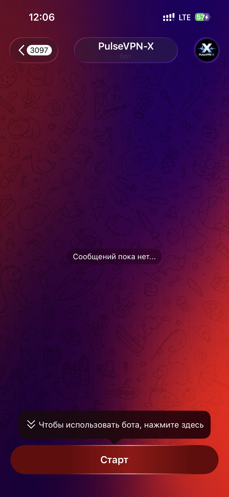

# 🔐 PulseVPN-X — VPN via Telegram in 1 Minute

PulseVPN-X is a high-speed WireGuard VPN delivered entirely through Telegram.

No dashboards.  
No manual configuration.  
No technical knowledge required.

Open the bot → press a button → scan QR → connected.

---

## ⚡ Performance

Built on pure WireGuard with optimized server routing.

In real-world usage PulseVPN-X performs **up to 3x faster than HitVPN**,  
while keeping connection stable and latency low.

Fast handshake.  
Minimal overhead.  
Clean routing.

---

## 💳 Simple Payments

- ⭐ Telegram Stars integration
- 🪙 Optional crypto payments
- 🎁 One-click trial activation

Stars payments make it extremely simple:
no external gateways, no card forms — just Telegram native checkout.

Affordable pricing with instant activation.

👉 **Launch the bot:**  
https://t.me/pulsevpnx_bot

---

## 🎯 Goal

Create a VPN service where:

- setup takes less than a minute
- every user gets one secure personal config
- subscription logic is automated
- admin has full visibility of active peers
- expired users are revoked automatically

---

## ✅ Implemented Features

- ⚡ WireGuard-based VPN
- 📲 QR + config file delivery
- 🎁 Trial period (button-based activation)
- 💳 Telegram Stars payments
- 🪙 Crypto support (optional)
- ⏳ Automatic peer revocation on expiration
- 📡 Live peer monitoring (`wg show`)
- 📊 Admin statistics dashboard
- 🔁 Restore peers on bot restart

---

## 🧩 Tech Stack

- Python 3.12
- Aiogram 3
- SQLite (aiosqlite)
- WireGuard (wg / wg-quick)
- Linux VPS
- Systemd service

---

## 🖼 Visuals

### Hero

## Screenshots

| | | |
|---|---|---|
|  |  |  |

---

## 🧠 UX Flow

1) User activates Trial or purchases subscription  
2) Presses “Get Config”  
3) Bot generates personal WireGuard peer  
4) User scans QR → enables toggle → connected  

Everything happens inside Telegram.

---

## 📌 Result

PulseVPN-X transforms VPN setup into a product experience:

Fast.  
Minimal.  
Controlled.  
Scalable.

Telegram becomes the interface.
WireGuard becomes the engine.