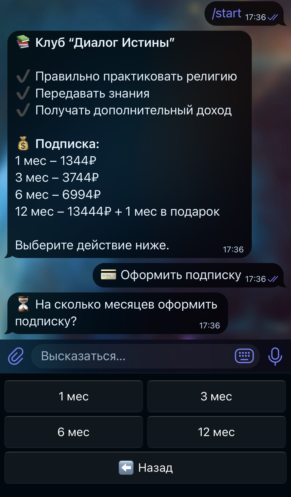

### Project Overview

This Telegram bot was created for my client — an educational club aiming to simplify the subscription and management process.

The bot allows users to:

- Choose subscription periods (1, 3, 6, or 12 months)
- Submit payment confirmation (screenshot)
- Receive a link to a private group after payment approval
- Access personal cabinet with subscription details

Administrators have handy tools for:

- Approving or denying payments
- Viewing subscriber lists and subscription statuses
- Cancelling subscriptions
- Broadcasting messages to all subscribers
- Searching users by username

---

### Target Audience

- Educational clubs and courses looking to automate subscription processes
- Small businesses working with paid access via Telegram
- Admins on a budget who want a simple and reliable bot

---

### Technologies Used

- **Python 3.11+** — primary programming language
- **Aiogram** — asynchronous framework for Telegram bots
- **SQLite** — lightweight built-in database for subscriber storage
- **Asynchronous programming** — efficient request handling without blocking

---

### Key Features

- User interaction via friendly keyboards and finite state machine (FSM)
- Admin panel protected by a list of admins (supports multiple admins)
- Automatic reminders 2 days before subscription expiration
- Access control to private group: the bot bans/unbans Telegram users accordingly

---

### Bot Screenshots

*Main menu with action choices*

*Subscription flow and period selection*

*Admin menu for subscription management*

---

### How to Run

- Requires Python 3.11+ installed
- Install dependencies from `requirements.txt`
- Set the `TOKEN` environment variable with your Telegram bot token
- Run the bot using:

- For continuous operation, deploy the bot on a server or cloud (Heroku, VPS, etc.)

---

### Repository

[GitHub](https://github.com/yourusername/telegram-subscription-bot)

---

*If interested or want to customize it further — feel free to contact me!*