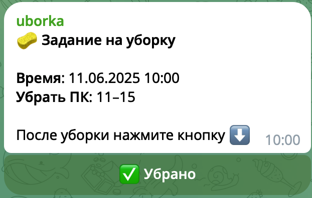
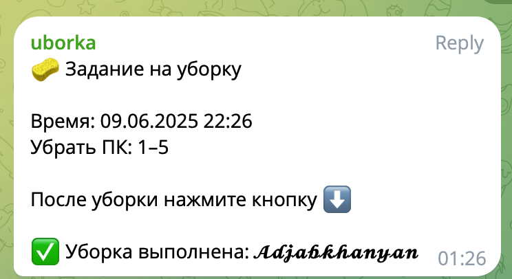

## About the Project

**UBORKA Bot** is a project aimed at automating the distribution of cleaning tasks within a team. Using a Telegram bot, users receive reminders, mark task completion, and help maintain order in the group.

---

### 📋 **Features**

- **Task automation:** Assigning cleaning duties to groups at scheduled times.  
- **Interactivity:** Users confirm task completion via Telegram.  
- **Flexibility:** Group shifts are automatically managed.  
- **Scheduler:** Uses `APScheduler` library for regular reminders.

---

### 📦 **Technologies**

- **Programming language:** Python  
- **Telegram API:** Bot interaction via `aiogram` library  
- **Scheduler:** `APScheduler` for task scheduling  
- **Hosting:** Railway

---

### 🛠️ **Key Functions**

#### 1. **Reminder Broadcast**  
Daily notifications sent specifying which group should clean the computers.

#### 2. **Interactive Feedback**  
After cleaning, participants press the "✅ Done" button to confirm completion.

#### 3. **Reporting**  
The bot records who completed the task by adding the user's name to the message.

---

### 🎯 **Results**

- **Improved discipline:** Clear task assignments.  
- **Time saving:** No manual reminders needed.  
- **Ease of use:** Users interact via a convenient Telegram interface.

---

### 📅 **Development Stages**

1. **Creating task logic**  
2. **Bot development using `aiogram`**  
3. **Scheduler integration**  
4. **Deployment on Railway**  
5. **Testing and launch**

---

### 📸 **Project Screenshots**

  
*Cleaning reminder with task completion confirmation.*

  
*Telegram bot interface for confirming cleaning.*

---

### 🌐 **Links**

- [GitHub repository](https://github.com/your-username/uborka-bot)

---

### 💡 **Conclusion**

The **UBORKA Bot** project demonstrated how simple tasks can be effectively automated. This solution can be adapted for other purposes like event management, duty assignments, and more.

If you have ideas needing automation, I’m ready to build a user-friendly Telegram bot for you!

---

### 📩 **Contact Me**

- Email: [adjabkhanian@gmail.com](mailto:adjabkhanian@gmail.com)  
- Telegram: [@adjabkhanyan](https://t.me/adjabkhanyan)

---