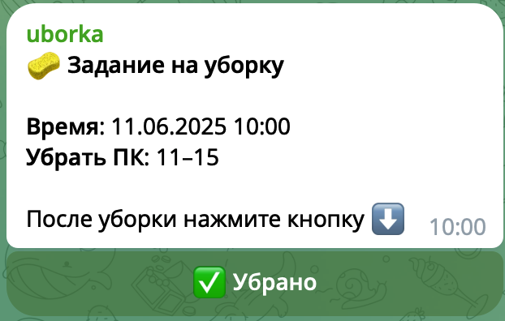
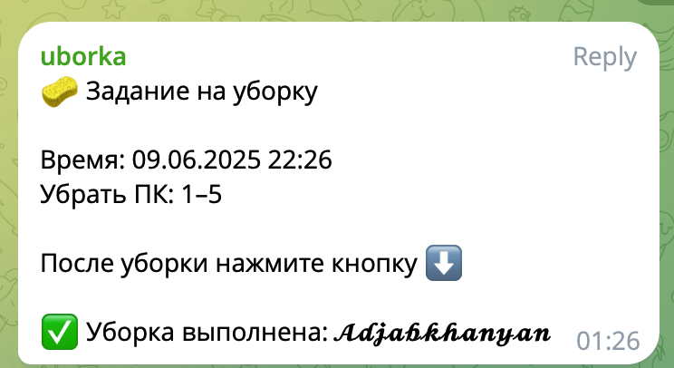

## О проекте

**UBORKA Bot** — это проект, направленный на автоматизацию распределения задач по уборке в коллективе. С помощью Telegram-бота пользователи получают напоминания, указывают выполнение задач и следят за порядком в группе.

---

### 📋 **Особенности**

- **Автоматизация задач:** Распределение уборки между группами в строго заданное время.
- **Интерактивность:** Пользователи подтверждают выполнение уборки через Telegram.
- **Гибкость:** Смены групп настраиваются автоматически.
- **Планировщик задач:** Используется библиотека `APScheduler` для регулярных напоминаний.

---

### 📦 **Технологии**

- **Язык программирования:** Python
- **Telegram API:** Работа с ботами через библиотеку `aiogram`
- **Планировщик:** `APScheduler` для запуска задач
- **Хостинг:** Railway

---

### 🛠️ **Ключевые функции**

#### 1. **Рассылка напоминаний**
Каждый день бот отправляет уведомления с указанием группы, которая должна убрать компьютеры.

#### 2. **Интерактивная обратная связь**
После выполнения уборки участники могут нажать кнопку "✅ Убрано", чтобы зафиксировать результат.

#### 3. **Отчётность**
Бот сохраняет информацию о том, кто выполнил задание, добавляя имя пользователя в сообщение.

---

### 🎯 **Результаты**

- **Повышение дисциплины:** Чёткое распределение обязанностей.
- **Экономия времени:** Нет необходимости вручную напоминать о задачах.
- **Простота использования:** Пользователи взаимодействуют через удобный интерфейс Telegram.

---

### 📅 **Этапы разработки**

1. **Создание логики задач**
2. **Разработка бота с использованием `aiogram`**
3. **Интеграция планировщика задач**
4. **Деплой на Railway**
5. **Тестирование и запуск**

---

### 📸 **Скриншоты проекта**

*Уведомление об уборке с возможностью отметить выполнение задачи.*

*Интерфейс Telegram-бота для подтверждения уборки.*

---

### 🌐 **Ссылки**

- [GitHub репозиторий проекта](https://github.com/your-username/uborka-bot)
- [Тестовый бот в Telegram](https://t.me/uborka_bot)

---

### 💡 **Заключение**

Проект **UBORKA Bot** показал, как можно эффективно автоматизировать простые задачи. Это решение может быть адаптировано для других целей, таких как управление мероприятиями, задачами по дежурству и т.д.

Если у вас есть идеи, которые требуют автоматизации, я готов реализовать их в виде удобного Telegram-бота!

---

### 📩 **Связаться со мной**

- Email: [adjabkhanian@gmail.com](mailto:adjabkhanian@gmail.com)
- Telegram: [@adjabkhanyan](https://t.me/adjabkhanyan)

---
