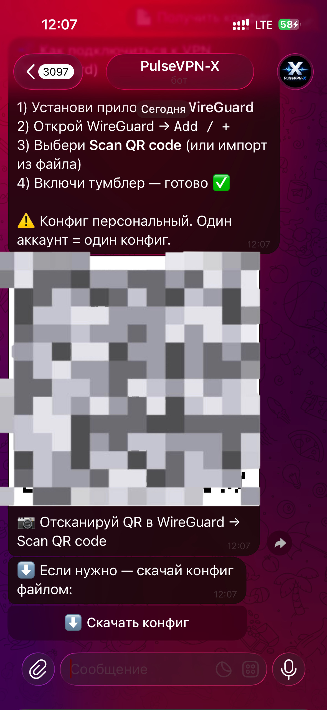

## 🔐 PulseVPN-X — VPN через Telegram за 1 минуту

PulseVPN-X — это Telegram-бот, который **выдаёт персональный WireGuard-конфиг** (QR + файл) и управляет доступом по подписке.  
Пользователю не нужно разбираться в настройках: **открыл бот → нажал кнопку → подключился.**

---

## 🎯 Задача

Сделать сервис, где:
- подключение к VPN максимально простое (даже для “не технарей”)
- каждому пользователю выдаётся **один уникальный конфиг**
- подписка/пробный период контролируются автоматически
- админ видит статистику и кто сейчас онлайн

---

## ✅ Что реализовано

- ⚡ **WireGuard** (быстро и стабильно)
- 📲 Выдача конфига в боте: **QR + скачивание файла**
- 🎁 Пробный период по кнопке (trial)
- 💳 Оплата: Telegram Stars + Crypto (если включено)
- ⏳ Авто-ревокация просроченных: удаление peer + чистка данных в БД
- 🛠 Админ-меню:
  - 📡 кто онлайн (wg show)
  - 📊 статистика пользователей и оплат

---

## 🧩 Технологии

- Python 3.12
- Aiogram 3
- SQLite (aiosqlite)
- WireGuard (wg / wg-quick)
- Systemd service (Linux VPS)

---

## 🖼 Визуалы

### Hero

### Screenshots

---

## 🧠 UX-логика (коротко)

1) Пользователь жмёт **Пробный период** или оплачивает подписку  
2) Жмёт **Получить конфиг**  
3) Бот отдаёт QR/файл → пользователь импортирует в WireGuard → включил тумблер ✅

---

## 📌 Результат

PulseVPN-X превратил “настройку VPN” в **понятный продуктовый флоу** в Telegram: просто, быстро и контролируемо.