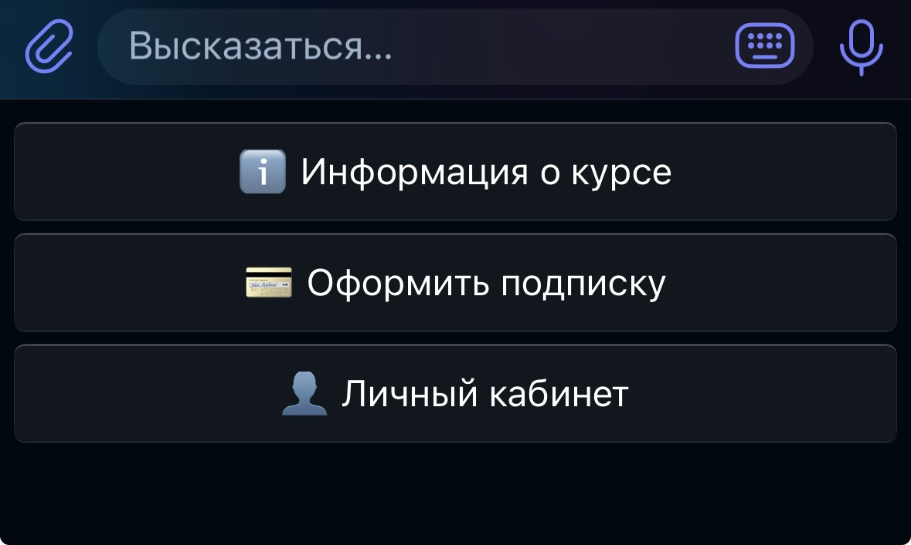
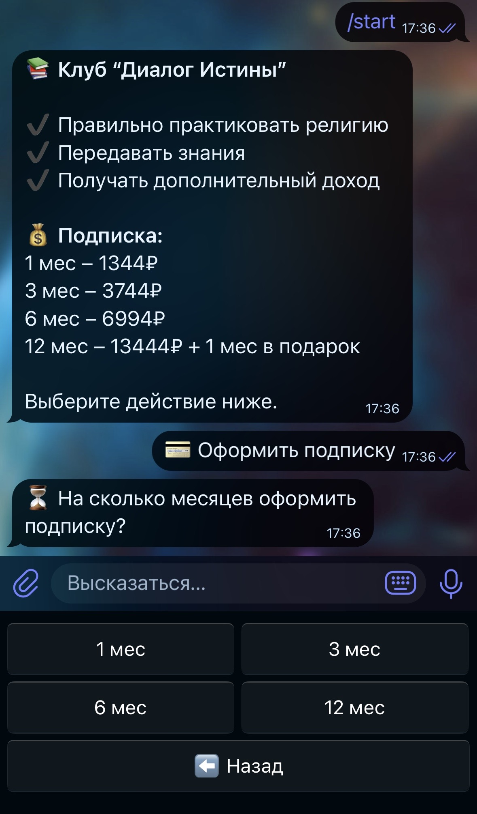
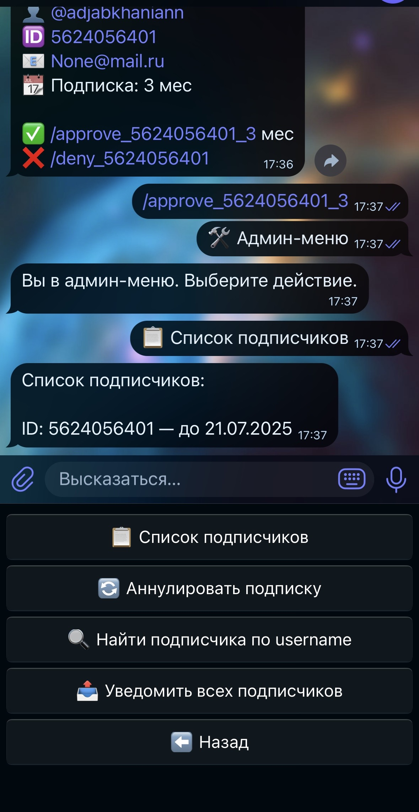

### Обзор проекта

Этот Telegram-бот создан специально для моего заказчика — образовательного клуба, который хочет упростить процесс оформления подписок и управления ими.

Бот позволяет пользователям:

- Выбирать период подписки (1, 3, 6 или 12 месяцев)
- Отправлять подтверждение оплаты (скриншот)
- Получать ссылку на закрытую группу после подтверждения оплаты
- Просматривать личный кабинет с актуальной информацией о подписке

Администраторы получают удобные инструменты для:

- Подтверждения или отклонения платежей
- Просмотра списка подписчиков и их подписок
- Аннулирования подписок
- Рассылки сообщений всем подписчикам
- Поиска пользователей по username

---

### Для кого этот проект?

- Образовательные клубы и курсы, желающие автоматизировать процесс подписки
- Малый бизнес, работающий с платным доступом через Telegram
- Администраторы со скромным бюджетом, которым нужен простой и надёжный бот

---

### Технологии

- **Python 3.11+** — основной язык программирования
- **Aiogram** — асинхронный фреймворк для Telegram-ботов
- **SQLite** — лёгкая и встроенная база данных для хранения подписчиков
- **Асинхронность** — эффективное управление запросами без блокировок

---

### Особенности реализации

- Взаимодействие с пользователями происходит через удобные клавиатуры и состояния (FSM)
- Админ-панель защищена списком администраторов (можно добавить несколько)
- Автоматические напоминания за 2 дня до окончания подписки
- Контроль доступа к закрытой группе: бот банит/разбанивает пользователей в Telegram

---

### Скриншоты работы бота

*Главное меню с выбором действий*

*Оформление подписки и выбор периода*

*Админ-меню для управления подписками*

---

### Как запустить проект

- Необходимо иметь установленный Python 3.11+
- Установить зависимости из `requirements.txt`
- Заполнить переменную окружения `TOKEN` — токен Telegram-бота
- Запустить бота командой:

- Для постоянной работы рекомендуется разместить бота на сервере или в облаке (Heroku, VPS и др.)

---

### Репозиторий

[GitHub](https://github.com/adjabkhanian/telegram-subscription-bot)

---

*Если заинтересовались или хотите доработать — пишите!*